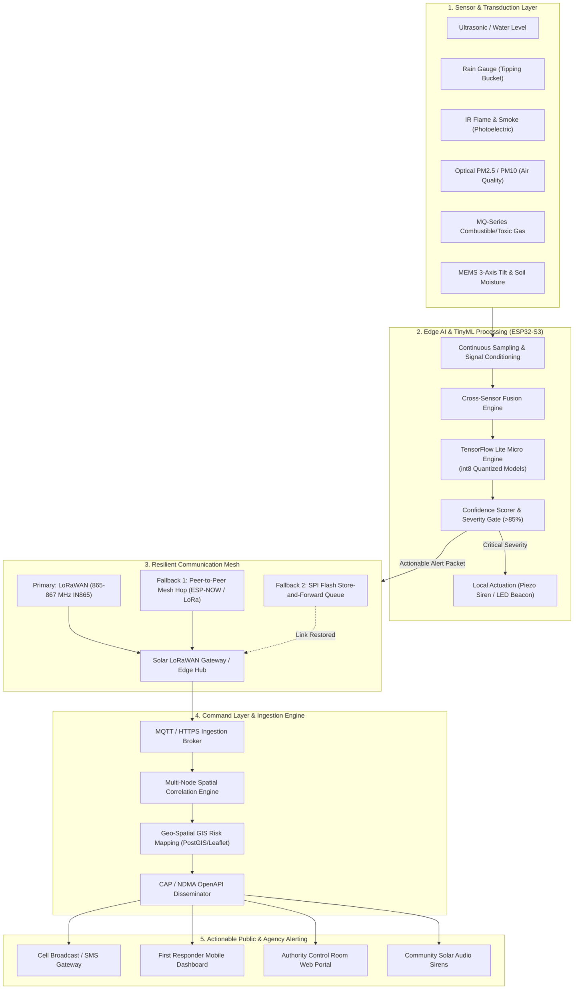
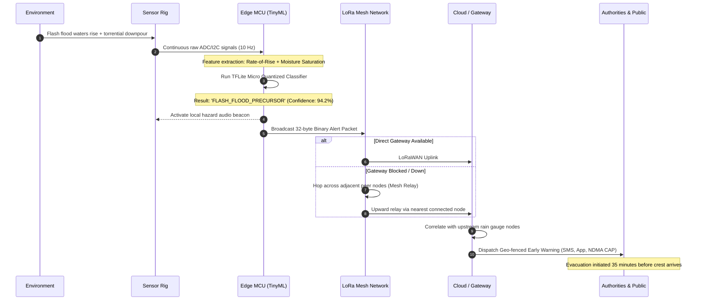
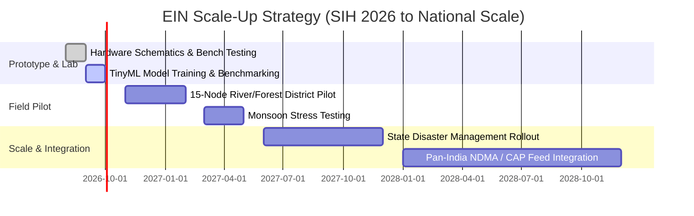

# 🌿 Environmental Intelligence Network (EIN)

<div align="center">

[](https://sih.gov.in)
[](https://sih.gov.in)
[](https://opensource.org/licenses/MIT)
[](https://www.tensorflow.org/lite/microcontrollers)
[](https://lora-alliance.org)

**Decentralized, Solar-Autonomous Edge-AI Sensor Network for Hyper-Local Early Warning & Disaster Resilience Across India**

[Explore Architecture](#-system-architecture) • [How It Works](#-how-it-works) • [Hardware & BOM](#-hardware-components--bill-of-materials) • [TinyML Pipeline](#-software-and-tinyml-pipeline) • [Quickstart](#-getting-started)

---

</div>

## 📌 Executive Summary

India experiences severe and recurring environmental hazards: urban waterlogging, flash floods, Himalayan landslides, forest fires in Uttarakhand and the Northeast, toxic industrial leaks, and hazardous AQI smog episodes. While central agencies like **NDMA, IMD, CPCB, and ISRO** provide vital macro-level forecasts, disaster impact is intensely localized. 

The **Environmental Intelligence Network (EIN)** bridges this critical "last-mile detection gap." EIN is a decentralized mesh of ruggedized, solar-powered, AI-equipped IoT nodes. Operating on the principle of **"Sense Locally, Decide Locally, Transmit Only What Matters"**, each node runs ultra-compact **TinyML** models on-device (ESP32/ARM Cortex-M). It classifies hazard precursors at the point of inception within milliseconds, transmitting lightweight, encrypted actionable alerts via **LoRaWAN / Mesh Relay**—even when terrestrial cellular towers, fiber backhauls, and power grids fail.

---

## 📋 SIH 2026 Problem Statement Alignment

| Attribute | Details |
| :--- | :--- |
| **Problem Statement No.** | **178** (SIH 2026) |
| **Problem Title** | AI Environmental Early-Warning Network |
| **Domain Bucket** | Disaster Management / Environment, Climate & Smart Cities |
| **Target End-Users** | NDMA, State Disaster Management Authorities (SDMAs), Municipal Corporations, Forest Departments, Vulnerable Communities |
| **Core Value Proposition** | Sub-second offline threat classification + Multi-hazard infrastructure + Zero-grid autonomous survival |

---

## 📊 Key Highlights & Metrics

```
  ┌─────────────────┐   ┌─────────────────┐   ┌─────────────────┐   ┌─────────────────┐
  │   < 1.2 sec     │   │   15+ km        │   │    72+ hrs      │   │   < ₹3,200      │
  │ On-Device Infer │   │ LoRa Mesh Reach │   │ Solar Autonomy  │   │  Per-Node BOM   │
  └─────────────────┘   └─────────────────┘   └─────────────────┘   └─────────────────┘
```

- **⚡ Offline Autonomy:** Continues sensing and running neural-network inference during total grid and internet blackouts.
- **📡 Bandwidth Efficiency:** 99.8% reduction in network traffic by streaming only 32-byte binary alert packets instead of continuous raw telemetry.
- **🛡️ Tri-Tier Resilience:** LoRaWAN Primary $\rightarrow$ Multi-hop Mesh Relay $\rightarrow$ Local Flash Store-and-Forward buffer.
- **🔄 Multi-Hazard Single Rig:** Monitors floods, wildfires, air toxicity, landslides, and gas leaks on one shared platform.

---

## ⚖️ Innovation & Competitive Differentiation

| Parameter | Traditional Centralized Systems | Standard Cloud IoT Gateways | **EIN (Our Solution)** |
| :--- | :--- | :--- | :--- |
| **Inference Location** | Central Cloud / Supercomputer | Cloud Servers | **On-Device (Edge TinyML)** |
| **Grid Failure Resilience** | ❌ Fails when local grid/towers drop | ❌ Requires active cellular link | **✅ 100% Autonomous (Solar + Li-ion)** |
| **Detection Latency** | Minutes to Hours (batch cycles) | 10 – 30 seconds | **< 1.2 seconds (Immediate)** |
| **Bandwidth Demand** | Continuous high data uplink | Continuous sensor telemetry | **Event-Driven 32-byte Alerts Only** |
| **False-Positive Handling** | Threshold alerts cause alarm fatigue | Rule-based heuristics | **Confidence-Scored Neural Fusion** |
| **Infrastructure Silos** | Separate flood gauges, fire towers | Fragmented single-purpose rigs | **Unified Multi-Hazard Sensor Fusion** |

---

## 🏗️ System Architecture



---

## ⚙️ How It Works: End-to-End Threat Lifecycle



---

## 🧰 Hardware Components & Bill of Materials

Engineered with off-the-shelf, cost-optimized, and ruggedized components suitable for mass deployment across rural and forested terrain.

| Category | Component | Model / Part No. | Interface | Estimated Cost (INR) | Primary Function |
| :--- | :--- | :--- | :--- | :---: | :--- |
| **Compute / MCU** | Dual-core 32-bit Xtensa LX7 MCU + AI Vector Instructions | ESP32-S3-WROOM-1 | I2C, SPI, UART, ADC | ₹380 | On-device TinyML inference & power management |
| **Connectivity** | Ultra Long Range LoRa Transceiver | Semtech SX1262 (865-867 MHz) | SPI | ₹420 | 10–15 km node-to-gateway telemetry |
| **Flood Sensing** | Weatherproof Ultrasonic Sensor | JSN-SR04T (Waterproof) | UART / GPIO | ₹280 | Non-contact water level / river stage profiling |
| **Precipitation** | Tipping Bucket Rain Gauge Module | Optical/Reed Switch Gauge | Digital Pulse | ₹350 | Rainfall intensity and accumulation tracking |
| **Fire & Smoke** | Dual-Spectrum Optical + Photoelectric | MQ-2 + Flame IR Phototransistor | Analog / Digital | ₹190 | Wildfire flame detection & particulate smoke |
| **Air Quality** | Laser Scattering Particulate Matter | Plantower PMS5003 / SDS011 | UART (Serial) | ₹680 | Real-time PM2.5, PM10 atmospheric AQI |
| **Toxic Gas** | Electrochemical Gas Detector | MQ-135 / MQ-7 | Analog ADC | ₹130 | Industrial ammonia, CO, benzene, smoke leaks |
| **Landslide** | 3-Axis MEMS Accelerometer / Inclinometer | MPU-6050 / ADXL345 | I2C | ₹120 | Slope shift, earth tremors, tilt angle warning |
| **Soil State** | Corrosion-Resistant Soil Moisture | Capacitive V1.2 Probe | Analog ADC | ₹70 | Ground water saturation index |
| **Power Plant** | Monocrystalline Solar Panel (6V 3W) | 145mm x 145mm Waterproof | DC In | ₹240 | Off-grid harvesting during daylight hours |
| **Energy Buffer** | 18650 Li-ion Cells (2S 5200mAh) + BMS | Samsung/LG 2600mAh x 2 | TP4056 + Protection | ₹310 | 72-hour sustained runtime during zero sunlight |
| **Enclosure** | Weatherproof Polycarbonate Box | IP66 Cable Gland Enclosure | Hardware | ₹190 | Ingress protection against monsoons and heat |
| **Total Node Cost**| — | — | — | **~₹3,360** | **Ready for mass public procurement** |

---

## 🧠 Software and TinyML Pipeline

```
Raw Multi-Sensor Stream  ──>  Sliding Window Normalization  ──>  Feature Extraction  ──>  Quantized int8 TFLite Micro  ──>  Confidence Scoring  ──>  Binary Packetizer
```

### On-Device Model Architecture
- **Inference Runtime:** TensorFlow Lite Micro running on bare-metal FreeRTOS.
- **Model Quantization:** Post-Training Quantization (PTQ) converting `float32` weights to full `int8` representation.
- **Memory Footprint:**
  - **RAM Usage (Arena):** `< 42 KB`
  - **Flash Footprint:** `< 165 KB`
  - **Inference Time:** `65 ms – 140 ms` on 240 MHz ESP32-S3.

### Model Ensembles by Hazard Type
```
├── models/
│   ├── flood_predictor/         # Temporal 1D-CNN + Gated Recurrent Unit (water surge rate)
│   ├── wildfire_detector/       # Multi-variable gradient boosted tree (temp + humidity + CO + IR)
│   ├── landslide_precursor/     # Anomaly Autoencoder on MEMS tilt + soil saturation rate
│   └── industrial_leak/         # Multi-gas threshold & trajectory classification
```

---

## 📦 Ultra-Compact 32-Byte Alert Packet Structure

To operate efficiently over high-spreading-factor LoRaWAN (SF12) and mesh relays, telemetry is serialized into an ultra-lean binary struct:

```
 0                   1                   2                   3
 0 1 2 3 4 5 6 7 8 9 0 1 2 3 4 5 6 7 8 9 0 1 2 3 4 5 6 7 8 9 0 1
+-+-+-+-+-+-+-+-+-+-+-+-+-+-+-+-+-+-+-+-+-+-+-+-+-+-+-+-+-+-+-+-+
|   Sync 0xAA   |  Protocol Ver |         Node ID (16-bit)      |
+-+-+-+-+-+-+-+-+-+-+-+-+-+-+-+-+-+-+-+-+-+-+-+-+-+-+-+-+-+-+-+-+
| Hazard Code   | Severity (1-5)| Confidence %  | Battery Volts |
+-+-+-+-+-+-+-+-+-+-+-+-+-+-+-+-+-+-+-+-+-+-+-+-+-+-+-+-+-+-+-+-+
|                      Latitude (Float32)                       |
+-+-+-+-+-+-+-+-+-+-+-+-+-+-+-+-+-+-+-+-+-+-+-+-+-+-+-+-+-+-+-+-+
|                     Longitude (Float32)                       |
+-+-+-+-+-+-+-+-+-+-+-+-+-+-+-+-+-+-+-+-+-+-+-+-+-+-+-+-+-+-+-+-+
|                       Unix Epoch Timestamp                    |
+-+-+-+-+-+-+-+-+-+-+-+-+-+-+-+-+-+-+-+-+-+-+-+-+-+-+-+-+-+-+-+-+
|        Primary Metric Value   |      Secondary Metric Value   |
+-+-+-+-+-+-+-+-+-+-+-+-+-+-+-+-+-+-+-+-+-+-+-+-+-+-+-+-+-+-+-+-+
|          Mesh Hop Count       |       CRC-16 Checksum         |
+-+-+-+-+-+-+-+-+-+-+-+-+-+-+-+-+-+-+-+-+-+-+-+-+-+-+-+-+-+-+-+-+
```

---

## 🗺️ Deployment Roadmap for India



- **Phase 0 (Prototype - Current):** Single working prototype node with edge-AI sensor fusion, LoRa connectivity, and Web GIS dashboard.
- **Phase 1 (District Pilot - Months 4–8):** 15–25 nodes deployed along a vulnerable river basin (e.g., Brahmaputra tributary or Yamuna stretch) and forest fringe.
- **Phase 2 (District Scale-Up - Months 9–14):** Complete district deployment connected with District Disaster Management Authority (DDMA).
- **Phase 3 (State Rollout - Year 2):** Integration with State Emergency Operations Centres (SEOC) and Indian Meteorological Department (IMD) telemetry.

---

## 🛡️ Risk Assessment & Mitigation Matrix

> [!NOTE]
> Designed to operate reliably in the harshest Indian climatic conditions from 48°C Thar desert heat to Himalayan sub-zero monsoons.

| Threat Factor | Impact | Engineering Mitigation |
| :--- | :--- | :--- |
| **Extended Monsoon Cloud Cover** | Low solar generation | Power duty-cycling: Sleep current `< 15 µA`; 72+ hour battery reserve |
| **Flooding of Node Itself** | Hardware submergence | IP68 potting of lower modules, pole-elevated mast mounting (3–5m) |
| **Sensor Calibration Drift** | False positives over time | Dynamic self-calibration baselining + auto-zeroing via cloud peer-comparison |
| **Physical Vandalism / Wildlife** | Mast destruction | Tamper detection using internal MEMS accelerometer; hidden mast antennas |
| **RF Channel Jamming / Obstruction** | Alert transmission loss | Sub-GHz LoRa frequency agility + Multi-hop mesh relay around obstacles |

---

## 📁 Repository Structure

```text
SIH_SWARNIM/
├── firmware/                       # Edge Node Microcontroller Firmware
│   ├── src/
│   │   ├── main.cpp                # Core state-machine & FreeRTOS tasks
│   │   ├── sensors/                # Sensor drivers (Ultrasonic, PM, Gases, Tilt)
│   │   ├── tinyml/                 # TFLite Micro runtime & model tensor arena
│   │   └── comms/                  # LoRaWAN SX1262 & ESP-NOW Mesh relay handlers
│   └── platformio.ini              # PlatformIO embedded build configuration
├── models/                         # ML Model Training & Quantization
│   ├── datasets/                   # Environmental hazard time-series records
│   ├── notebooks/                  # Training notebooks (TensorFlow/Keras/Scikit)
│   ├── export/                     # int8 TFLite converted flatbuffers (.tflite)
│   └── model_data.h                # C++ hex array for embedded compilation
├── gateway/                        # Edge LoRaWAN Concentrator
│   ├── forwarder/                  # Packet forwarder (Semtech UDP / MQTT)
│   └── mesh_bridge.py              # Mesh-to-Cloud IP bridge
├── backend/                        # Cloud Orchestration Engine
│   ├── api/                        # FastAPI / Node.js REST & WebSocket endpoints
│   ├── correlation/                # Multi-sensor spatial-temporal correlation engine
│   ├── database/                   # TimescaleDB (time-series) + PostGIS (geospatial)
│   └── alerts/                     # NDMA Common Alerting Protocol (CAP) dispatcher
├── dashboard/                      # Web GIS Emergency Control Room
│   ├── src/
│   │   ├── components/             # React / Next.js real-time sensor cards
│   │   ├── map/                    # Mapbox / Leaflet interactive GIS heatmap
│   │   └── state/                  # Real-time WebSocket state management
│   └── package.json
└── docs/                           # Hardware Schematics, 3D Enclosure CAD, & Docs
```

---

## 🚀 Getting Started

### 1. Prerequisites
- **Embedded:** [PlatformIO IDE](https://platformio.org/) or [ESP-IDF](https://docs.espressif.com/projects/esp-idf/)
- **Backend:** [Python 3.10+](https://www.python.org/) & [Docker Desktop](https://www.docker.com/)
- **Frontend:** [Node.js 18+](https://nodejs.org/)

### 2. Firmware Flashing (ESP32-S3 Node)
```bash
# Clone the repository
git clone https://github.com/AnkitPandit120/SIH_Swarnim.git
cd SIH_Swarnim/firmware

# Build and flash to connected microcontroller
pio run --target upload
pio device monitor
```

### 3. Backend & GIS Dashboard Launch
```bash
# Launch TimescaleDB, PostGIS, MQTT Broker, and FastAPI
cd ../backend
docker-compose up -d

# Run local frontend GIS dashboard
cd ../dashboard
npm install
npm run dev
# Open http://localhost:3000 to view live disaster simulation map
```

---

## 🎯 Target UN Sustainable Development Goals (SDGs)

<div align="center">

| Goal 11 | Goal 13 | Goal 15 |
| :---: | :---: | :---: |
|  |  |  |

</div>

---

## 👥 Team Swarnim

| Name | Role | Core Focus | Contact |
| :--- | :--- | :--- | :--- |
| **[Member Name]** | Team Lead / AI Systems | TinyML Model Training & Quantization | [@GitHub](https://github.com) |
| **[Member Name]** | Embedded Hardware Lead | Circuit Schematics, Power & Sensor Rig | [@GitHub](https://github.com) |
| **[Member Name]** | IoT & Network Engineer | LoRaWAN / Mesh Protocol Stack | [@GitHub](https://github.com) |
| **[Member Name]** | Full Stack Developer | GIS Risk Dashboard & Ingestion Broker | [@GitHub](https://github.com) |
| **[Member Name]** | Backend & DevOps | Spatial Correlation Engine & CAP Alerts | [@GitHub](https://github.com) |
| **[Member Name]** | Domain & UI/UX Specialist | Disaster Protocol & Civic Alert Apps | [@GitHub](https://github.com) |

---

## 📜 References & Acknowledgements

1. **National Disaster Management Authority (NDMA):** [Guidelines on Early Warning Systems](https://www.ndma.gov.in)
2. **ITU Common Alerting Protocol (CAP):** Recommendation ITU-T X.1303 for emergency public warnings.
3. **TensorFlow Lite for Microcontrollers:** *David et al., Embedded Machine Learning on TinyML Systems* ([arXiv:2010.08678](https://arxiv.org/abs/2010.08678)).
4. **LoRa Alliance:** Regional Frequency Allocation Specifications for India (IN865-867).
5. **Central Pollution Control Board (CPCB):** National Ambient Air Quality Standards (NAAQS).
