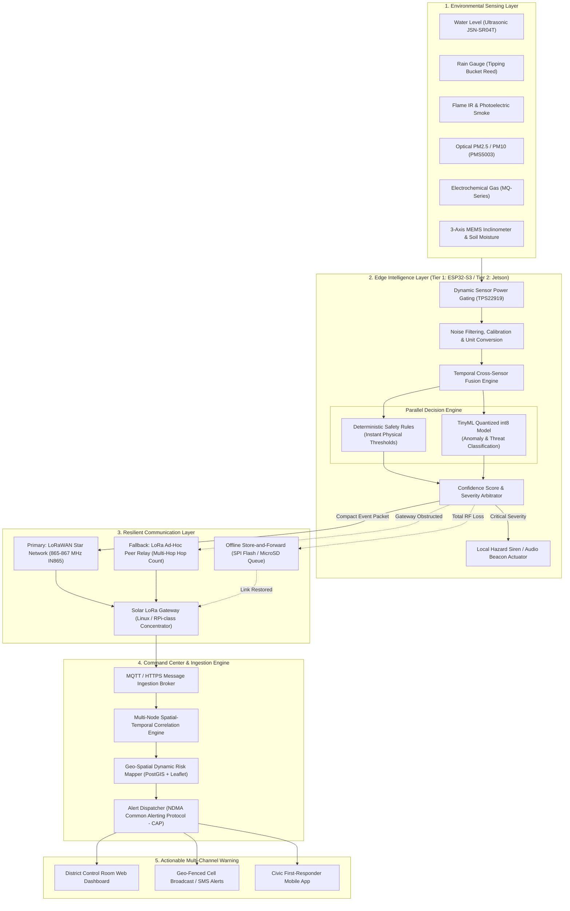
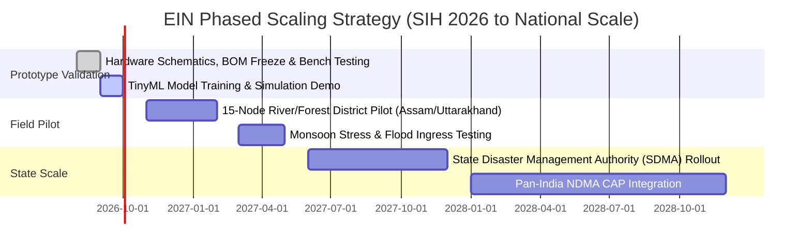

# 🌿 Environmental Intelligence Network (EIN)

<div align="center">

[](https://sih.gov.in)
[](https://www.qualcomm.com)
[](https://sih.gov.in)
[](https://sih.gov.in)
[](https://www.tensorflow.org/lite/microcontrollers)
[](https://lora-alliance.org)

**Decentralized, Solar-Autonomous Edge-AI Multi-Hazard Early Warning Network for India**

[System Architecture](#-high-level-system-architecture) • [Two-Tier Compute](#-two-tier-compute-architecture) • [Modular Node Profiles](#-modular-hazard-node-profiles) • [Hardware & BOM](#-hardware-components--bill-of-materials) • [Resilient Comms](#-resilient-communication-architecture) • [Quickstart](#-getting-started)

---

</div>

## 📌 Executive Summary

India experiences catastrophic, rapidly escalating environmental hazards: urban flash floods, Himalayan landslides, forest fires in Uttarakhand and the Northeast, toxic industrial leaks, and dangerous winter smog. While national agencies (**NDMA, IMD, CPCB, and ISRO**) provide vital macro-level meteorological forecasting, disasters strike at hyper-local coordinates where terrestrial communication and power infrastructure fail first.

The **Environmental Intelligence Network (EIN)** bridges this critical last-mile detection gap. Built for **SIH Problem Statement #26178 (Qualcomm Inc.)**, EIN is a decentralized network of autonomous, solar-powered sensor nodes that operates on a resilient founding principle:

> **Sense locally → Process locally → Decide locally → Act locally → Communicate intelligently → Coordinate centrally**

Instead of blindly streaming heavy raw sensor data over fragile cellular links, each node runs on-device preprocessing, sensor fusion, and **Edge AI / deterministic safety logic**. If a hazard threshold or anomaly pattern is confirmed, the node actuates immediate local alarms (sirens/beacons) and transmits an ultra-compact **32-byte actionable alert packet** over **Sub-GHz LoRa / LoRaWAN** to regional command centers and community channels.

---

## 📋 SIH 2026 Problem Alignment

| Attribute | Official Problem Details |
| :--- | :--- |
| **Problem Statement ID** | **26178** (Listed under SIH PS #178) |
| **Problem Title** | AI Environmental Early-Warning Network |
| **Organization** | **Qualcomm Inc.** |
| **Category** | **Hardware** (IoT Transduction, Embedded Systems & Edge AI) |
| **Theme** | **Disaster Management** |
| **Target Stakeholders** | NDMA, State Disaster Management Authorities (SDMAs), Municipal Corporations, Forest Departments, Vulnerable Communities |
| **Core Value Proposition** | Sub-second offline threat classification + Multi-hazard modular rigs + Zero-grid solar autonomy |

---

## 📊 Key Highlights & Technical Metrics

```text
  ┌─────────────────┐   ┌─────────────────┐   ┌─────────────────┐   ┌─────────────────┐
  │   < 120 ms      │   │   12–15 km      │   │    72+ hrs      │   │   ~₹3,360       │
  │ On-Device Infer │   │ Sub-GHz Reach   │   │ Zero-Sun Backup │   │  BOM (Field)    │
  └─────────────────┘   └─────────────────┘   └─────────────────┘   └─────────────────┘
```

- **⚡ Zero-Grid Autonomy:** Custom MPPT solar harvesting paired with thermally stable **LiFePO4 chemistry** (survives 0°C to 60°C Indian field temperatures).
- **🛡️ Deterministic Safety + AI Ensemble:** Parallel execution of hard physical safety rules alongside quantized neural models eliminates false negatives while providing transparent decision explainability.
- **📡 Bandwidth & Radio Discipline:** 99.8% reduction in channel congestion by streaming event-driven 32-byte binary payloads instead of round-the-clock sensor telemetry.
- **🔄 Graceful Degradation:** Full Online $\rightarrow$ Peer LoRa Relay $\rightarrow$ Local Flash Store-and-Forward $\rightarrow$ Local Audio Actuation if completely severed.

---

## ⚖️ Competitive Differentiation

| Parameter | Centralized Remote Sensing (IMD/ISRO) | Generic Cloud IoT Solutions | **EIN (Our Architecture)** |
| :--- | :--- | :--- | :--- |
| **Inference Location** | Central Server / Supercomputer | Remote Cloud Servers | **On-Device (Dual-Tier Edge AI)** |
| **Grid & Tower Blackout** | Fails when local power/fiber fails | Disconnects when cellular link drops | **100% Autonomous (Solar + LiFePO4 + LoRa)** |
| **Detection-to-Alert** | 15 minutes to several hours | 10 – 30 seconds | **< 1.2 seconds (Immediate local siren)** |
| **Network Overhead** | High-bandwidth periodic ingest | Continuous sensor telemetry streams | **32-byte Event Packets + Health Heartbeats** |
| **False-Alarm Resistance** | Single-sensor threshold trips | Heuristic static rules | **Multi-Sensor Fusion + Anomaly Autoencoders** |
| **Deployment Hardware** | Multi-lakh meteorological stations | Single-purpose siloed gadgets | **Modular Open-Standard Rig (~₹3,360/node)** |

---

## 🏗️ High-Level System Architecture



---

## 💻 Two-Tier Compute Architecture

To balance cost, power consumption, and advanced AI requirements across vast geographic corridors, EIN implements a **tiered compute paradigm**:

```text
  ┌──────────────────────────────────────────────┐     ┌──────────────────────────────────────────────┐
  │         TIER 1: ULTRA-LOW-POWER NODE         │     │         TIER 2: HIGH-COMPUTE EDGE HUB        │
  ├──────────────────────────────────────────────┤     ├──────────────────────────────────────────────┤
  │ • Compute: ESP32-S3 Dual-Core Xtensa LX7     │     │ • Compute: NVIDIA Jetson Orin Nano / Linux   │
  │ • Power: 3.3V, < 15 µA Deep-Sleep Current    │     │ • Power: 10W–15W, Active MPPT Solar Array    │
  │ • Logic: int8 TinyML + Deterministic Rules   │     │ • Logic: Multi-Stream Vision + Complex Fusion│
  │ • Deployment: Thousands across rivers/slopes │     │ • Deployment: Critical bridges, dams & hubs  │
  │ • Unit BOM: ~₹3,360 ($40 USD)                │     │ • Role: Heavy AI + Regional Cluster Gateway  │
  └──────────────────────────────────────────────┘     └──────────────────────────────────────────────┘
```

---

## 🧩 Modular Hazard Node Profiles

EIN does **not** force a one-size-fits-all hardware rig. Instead, a standardized baseboard hosts interchangeable sensor daughter modules based on terrain:

| Node Type | Primary Sensors | Typical Deployment Site | Key Target Event |
| :--- | :--- | :--- | :--- |
| **🌊 Flood Node (Flagship Prototype)** | Waterproof Ultrasonic (JSN-SR04T) + Tipping-Bucket Rain Gauge + SHT31 | River banks, bridges, culverts, urban stormwater drains | Flash floods, river crest surges, cloudburst runoff |
| **🔥 Forest Fire Node** | IR Flame Sensor + Photoelectric Smoke + Optical PM2.5 + Ambient Temp/RH | Forest perimeters, wildlife sanctuaries, fire-break ridges | Wildfire inception, smoldering biomass, canopy flame |
| **⛰️ Landslide Node** | Capacitive Soil Moisture + 3-Axis MEMS Inclinometer (MPU6050) + Vibration | Hillside road-cuts, Ghat roads, Himalayan slopes | Slope tilt shift, earth saturation, debris flow precursors |
| **🏭 Industrial & Air Quality** | Optical PMS5003 + Multi-Gas Array (MQ-135, MQ-7, CO, Ammonia) | Chemical industrial estates, highway intersections, dense slums | Toxic gas release, hazardous AQI smog episodes |
| **💧 Water Quality Node** | Industrial pH Probe + Turbidity + TDS / Electrical Conductivity | Reservoirs, lakes, industrial effluent discharge points | Chemical dumping, post-flood potable water contamination |

---

## 🧰 Hardware Components & Bill of Materials

### Flagship Flood Node Reference Design (Tier 1 Production BOM)

| Component | Part / Model | Interface | Unit Cost (INR) | Function |
| :--- | :--- | :--- | :---: | :--- |
| **Microcontroller** | ESP32-S3-WROOM-1 (16MB Flash, 8MB PSRAM) | I2C, SPI, UART, ADC | ₹380 | Dual-core processing & TinyML int8 runtime |
| **Sub-GHz Transceiver** | Semtech SX1276 / SX1262 (865–867 MHz IN865) | SPI + DIO0 IRQ | ₹420 | 12–15 km line-of-sight LoRa telemetry |
| **Water Level Transducer** | JSN-SR04T Waterproof Ultrasonic Sensor | GPIO Trigger / Echo | ₹280 | Non-contact river and drain stage monitoring |
| **Precipitation Sensor** | Optical / Reed Tipping Bucket Rain Gauge | GPIO Hardware Interrupt | ₹350 | Real-time rainfall rate (mm/hr accumulation) |
| **Precision Analog ADC** | Texas Instruments ADS1115 (16-bit 4-Channel) | I2C (0x48) | ₹140 | High-accuracy sensor conditioning & battery sense |
| **Real-Time Clock (RTC)** | Analog Devices DS3231 (TCXO Industrial Temp) | I2C (0x68) | ₹110 | Exact timestamping during total network blackouts |
| **Environmental Context** | Sensirion SHT31-DIS-B | I2C (0x44) | ₹120 | Ambient temperature & relative humidity reference |
| **Solar MPPT Controller** | TI BQ24650 / LTC4015 Synchronous Buck Charger | Circuit | ₹260 | High-efficiency MPPT harvesting in overcast skies |
| **Energy Storage Pack** | 18650 LiFePO4 Battery Cells (3.2V 3200mAh x 2) | Battery Rail | ₹480 | Thermal safety up to 60°C; 2,000+ lifecycle cycles |
| **Photovoltaic Collector**| 6V 5W Monocrystalline Waterproof Panel | DC Jack | ₹290 | Autonomous daylight energy replenishment |
| **Power Gating Switches** | TI TPS22919 Load Switches with Quick Discharge | GPIO Controlled | ₹70 | Completely isolates unneeded sensors during sleep |
| **Ruggedized Enclosure** | Polycarbonate IP66 Case with PG9 Cable Glands | Mechanical | ₹210 | Weatherproof seal against monsoon deluge and dust |
| **Total Node Cost** | — | — | **~₹3,360** | **Viable for mass panchayat-level procurement** |

---

## 🧠 Dual-Stage Safety & TinyML Pipeline

To ensure human-life safety, **EIN never relies on machine learning as an opaque single point of failure**.

```text
                  Multi-Sensor Stream (Level, Rain, Temp, Gas)
                                       │
                                       ▼
                       Preprocessing & Noise Calibration
                                       │
                    ┌──────────────────┴──────────────────┐
                    ▼                                     ▼
        Deterministic Safety Rules              Quantized TinyML Model
        (Strict Physical Thresholds)            (Anomaly & Trend Classifier)
                    │                                     │
                    └──────────────────┬──────────────────┘
                                       ▼
                         Dual-Gated Decision Engine
                                       │
             ┌─────────────────────────┴─────────────────────────┐
             ▼                                                   ▼
     Local Hazard Actuation                              Actionable Packet
   (Direct Piezo Siren / LED)                    (32-Byte LoRa Binary Broadcast)
```

1. **Deterministic Safety Rules:** If water level exceeds `CRITICAL_DATUM` or rate-of-rise exceeds `20 cm/hr`, the alarm triggers unconditionally—preventing algorithmic blind spots.
2. **Quantized Neural Classifiers:** A lightweight 1D-CNN + GRU model (`< 42 KB RAM`, `< 165 KB Flash`) evaluates temporal rate-of-change across rainfall, moisture, and level to predict flood crests **30–45 minutes in advance**.

---

## 📦 Ultra-Compact 32-Byte Alert Packet Structure

Transmitting verbose JSON over sub-GHz LoRaWAN drains battery and congests regional frequencies. EIN serializes all threat intelligence into a high-density 32-byte binary struct:

```text
 0                   1                   2                   3
 0 1 2 3 4 5 6 7 8 9 0 1 2 3 4 5 6 7 8 9 0 1 2 3 4 5 6 7 8 9 0 1
+-+-+-+-+-+-+-+-+-+-+-+-+-+-+-+-+-+-+-+-+-+-+-+-+-+-+-+-+-+-+-+-+
|   Sync (0xAA) | Protocol Ver  |       Node ID (16-bit)        |
+-+-+-+-+-+-+-+-+-+-+-+-+-+-+-+-+-+-+-+-+-+-+-+-+-+-+-+-+-+-+-+-+
| Hazard Code   | Severity (1-5)| Confidence %  | Battery Volts |
+-+-+-+-+-+-+-+-+-+-+-+-+-+-+-+-+-+-+-+-+-+-+-+-+-+-+-+-+-+-+-+-+
|                      Latitude (Float32)                       |
+-+-+-+-+-+-+-+-+-+-+-+-+-+-+-+-+-+-+-+-+-+-+-+-+-+-+-+-+-+-+-+-+
|                     Longitude (Float32)                       |
+-+-+-+-+-+-+-+-+-+-+-+-+-+-+-+-+-+-+-+-+-+-+-+-+-+-+-+-+-+-+-+-+
|                       Unix Epoch Timestamp                    |
+-+-+-+-+-+-+-+-+-+-+-+-+-+-+-+-+-+-+-+-+-+-+-+-+-+-+-+-+-+-+-+-+
|     Primary Metric (Int16)    |    Secondary Metric (Int16)   |
+-+-+-+-+-+-+-+-+-+-+-+-+-+-+-+-+-+-+-+-+-+-+-+-+-+-+-+-+-+-+-+-+
|   Relay Hop   |  Model Ver ID |        CRC-16 Checksum        |
+-+-+-+-+-+-+-+-+-+-+-+-+-+-+-+-+-+-+-+-+-+-+-+-+-+-+-+-+-+-+-+-+
```

### Actionable Alert Payload Example (Human-Readable Conversion)
```json
{
  "node_id": "EIN-FLD-0042",
  "hazard": "FLASH_FLOOD",
  "severity": "CRITICAL",
  "risk_score": 0.94,
  "confidence": 0.96,
  "location": { "lat": 26.1445, "lon": 91.7362 },
  "evidence": {
    "water_level_cm": 348,
    "rate_of_rise_cm_min": 4.6,
    "rainfall_intensity_mm_hr": 72.4,
    "upstream_corroboration": true
  },
  "recommended_action": "TRIGGER_ZONE_B_EVACUATION_ASSESSMENT",
  "timestamp": "2026-09-05T19:40:12Z"
}
```

---

## 📡 Resilient Communication Architecture

1. **Normal State (LoRaWAN Star Topology):** The node uplinks directly to a regional solar-powered LoRaWAN Gateway operating on Indian ISM bands (`IN865–867 MHz`).
2. **Gateway Obstructed (LoRa Ad-Hoc Peer Relay):** If the primary gateway is damaged or masked by terrain, the node shifts to a peer-to-peer relay mode, bouncing packets across neighboring nodes (with hop counters and de-duplication) until reaching a functioning gateway.
3. **Total Backhaul Outage (Store-and-Forward):** Alerts and historical data are stored in on-board SPI Flash / MicroSD with cryptographic verification and backoff retries until the gateway link is restored.

---

## 🗺️ Deployment Roadmap & National Scale



- **Phase 0 (Prototype - Present):** Single fully functional ESP32-S3 flood/environmental node with local buzzer, LoRa radio, and live GIS map.
- **Phase 1 (District Pilot - Months 4–8):** 15–20 nodes deployed along a vulnerable river stretch (e.g., Brahmaputra tributary or Yamuna basin) and forest corridor.
- **Phase 2 (District Scale-Up - Months 9–14):** Complete district coverage integrated with District Disaster Management Authority (DDMA) emergency rooms.
- **Phase 3 (State Integration - Year 2):** Live data feeds directly feeding the NDMA **Sachet** Early Warning platform via standard Common Alerting Protocols (CAP).

---

## 📁 Repository Structure

```text
SIH_SWARNIM/
├── firmware/                       # Edge Node Microcontroller Firmware
│   ├── src/
│   │   ├── main.cpp                # FreeRTOS task manager & power states
│   │   ├── sensors/                # Drivers: JSN-SR04T, SHT31, Rain Gauge, ADS1115
│   │   ├── tinyml/                 # TFLite Micro tensor arena & quantized models
│   │   ├── safety/                 # Deterministic fallback rules engine
│   │   └── comms/                  # SX1276 LoRaWAN & Peer Relay handlers
│   └── platformio.ini              # PlatformIO build configuration
├── models/                         # ML Model Training & Quantization Pipeline
│   ├── datasets/                   # Environmental hazard historical records
│   ├── notebooks/                  # Training notebooks (TensorFlow/Keras/Scikit)
│   └── export/                     # int8 quantized .tflite & model_data.h headers
├── gateway/                        # Field LoRaWAN Gateway / Hub
│   ├── forwarder/                  # Semtech packet forwarder to MQTT broker
│   └── mesh_bridge.py              # Peer-relay packet de-duplication bridge
├── backend/                        # Cloud / On-Premise Command Server
│   ├── api/                        # FastAPI REST & WebSocket streaming endpoints
│   ├── correlation/                # Multi-node spatial correlation engine
│   ├── database/                   # TimescaleDB (time-series) + PostGIS (GIS)
│   └── alerts/                     # NDMA Common Alerting Protocol (CAP) dispatcher
├── dashboard/                      # Real-time GIS Emergency Control Room
│   ├── src/
│   │   ├── components/             # Live sensor telemetry widgets & warning cards
│   │   └── map/                    # Leaflet / Mapbox dynamic hazard risk heatmap
│   └── package.json
└── docs/                           # Circuit Schematics, PCB CAD & Enclosure STLs
```

---

## 🚀 Getting Started

### 1. Prerequisites
- **Hardware Toolchain:** [PlatformIO IDE](https://platformio.org/) or [ESP-IDF v5.1+](https://docs.espressif.com/)
- **Backend Services:** [Python 3.10+](https://www.python.org/) & [Docker Desktop](https://www.docker.com/)
- **Frontend Dashboard:** [Node.js 18+](https://nodejs.org/)

### 2. Microcontroller Firmware Flash (ESP32-S3)
```bash
# Clone the project repository
git clone https://github.com/AnkitPandit120/SIH_Swarnim.git
cd SIH_Swarnim/firmware

# Build firmware and flash to USB-connected node
pio run --target upload
pio device monitor
```

### 3. Backend & GIS Dashboard Launch
```bash
# Spin up TimescaleDB, PostGIS, MQTT Broker, and FastAPI backend
cd ../backend
docker-compose up -d

# Launch real-time GIS command center dashboard
cd ../dashboard
npm install
npm run dev
# Open http://localhost:3000 in your browser
```

---

## 🎯 Target UN Sustainable Development Goals (SDGs)

<div align="center">

| Goal 11 | Goal 13 | Goal 15 |
| :---: | :---: | :---: |
|  |  |  |

</div>

---

## 👥 Team Swarnim

| Name | Role | Focus Area | Contact |
| :--- | :--- | :--- | :--- |
| **[Member Name]** | Team Lead / Embedded AI | TinyML Quantization & Dual Decision Engine | [@GitHub](https://github.com) |
| **[Member Name]** | Embedded Hardware Lead | Circuit Schematics, MPPT Power & Sensor Rig | [@GitHub](https://github.com) |
| **[Member Name]** | RF & Network Engineer | LoRaWAN Protocol & Ad-Hoc Peer Relay | [@GitHub](https://github.com) |
| **[Member Name]** | Full Stack GIS Developer | Real-Time GIS Heatmaps & Web Control Room | [@GitHub](https://github.com) |
| **[Member Name]** | Backend & Data Engineer | Spatial Correlation Engine & CAP Alerting | [@GitHub](https://github.com) |
| **[Member Name]** | Domain & UI/UX Specialist | Disaster Management Protocols & Field App | [@GitHub](https://github.com) |

---

## 📜 References & Acknowledgements

1. **Smart India Hackathon 2026:** Problem Statement #26178 (Qualcomm Inc.).
2. **National Disaster Management Authority (NDMA):** [Guidelines on Early Warning Systems & Sachet App](https://www.ndma.gov.in).
3. **ITU Common Alerting Protocol (CAP):** Recommendation ITU-T X.1303 for public warning dissemination.
4. **TensorFlow Lite Micro:** *David et al., Embedded Machine Learning on TinyML Systems* ([arXiv:2010.08678](https://arxiv.org/abs/2010.08678)).
5. **Semtech SX1276 / SX1262 LoRa Specifications:** Regional Sub-GHz Frequency Allocations for India (IN865–867).
